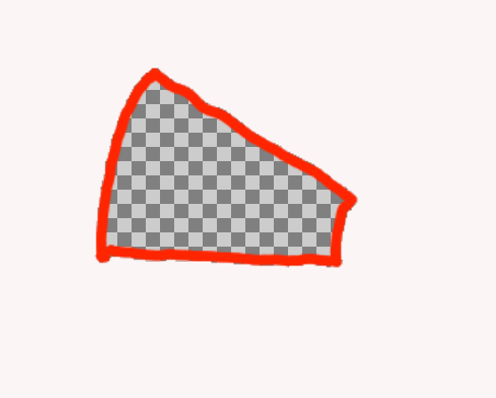
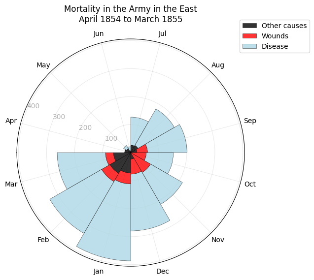
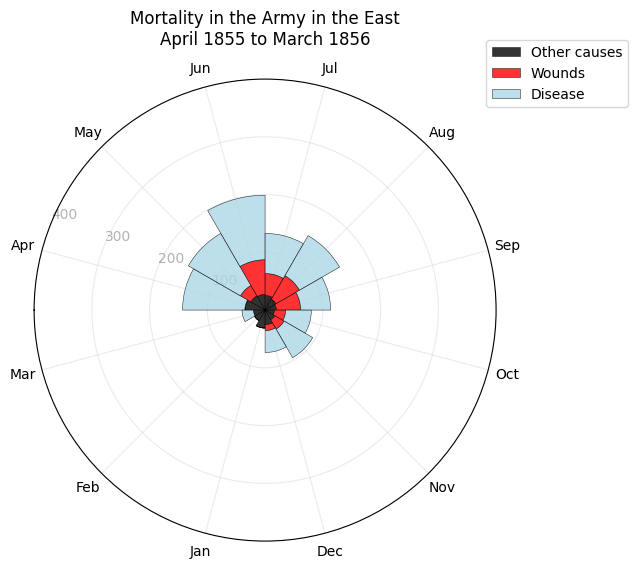
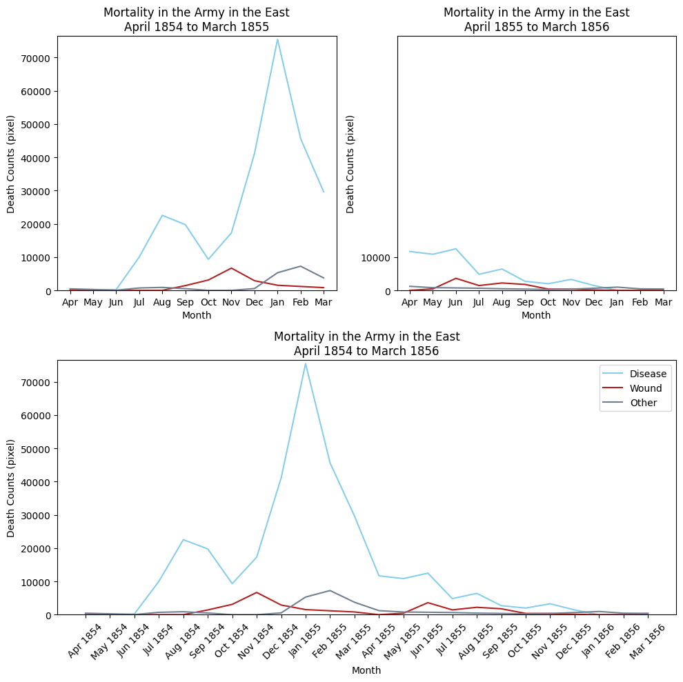
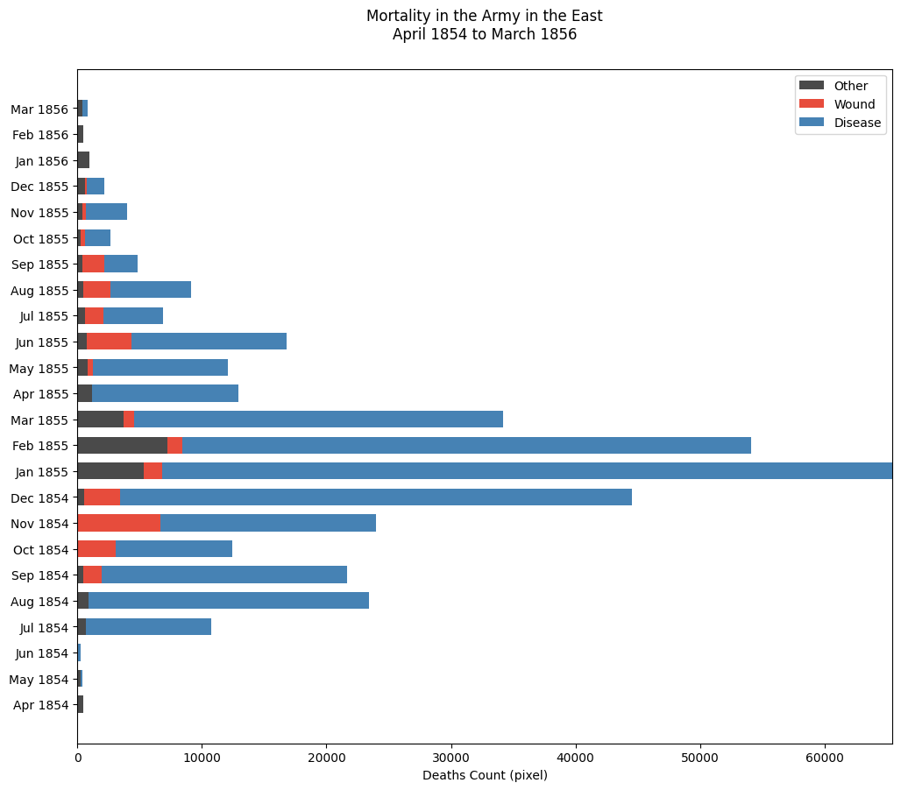

<!-- # Florence Nightingale's Rose Diagram — A Replication

 -->

<p align="center">
  
</p>

<h1 align="center">Florence Nightingale's Rose Diagram — A Replication</h1>

## The Story

During the Crimean War (1853-1856), Florence Nightingale collected data revealing that the majority of British military deaths resulted not from combat wounds but from preventable diseases caused by poor sanitary conditions. To communicate this sanitary reform crisis to policymakers, she created her iconic "coxcomb" or polar area diagram—a pioneering data visualization that made mortality patterns immediately apparent through proportional wedge areas. Her compelling visual argument directly influenced British military policy, leading to comprehensive hospital reforms and establishing data visualization as a powerful tool for driving evidence-based change.

<!--  -->

<p align="center">  </p>


## How the Data Was Collected

Since their is no exact count of mortality, we need to get the wedge areas by ourself. Here is how to do it.

1. Take out individual wedge areas
    * Open the original diagram using some painting applications (I am using Krita), and trace outline of wedges.
    * Use a photo editor to make the wedges area transparent, then save each wedge area as a PNG file with alpha (or transperancy) channel.
    * Save all wedges area with name yyyy-mm_(Cause of death).png to one folder.
    * below is an example of a transperant wedge area

<!--  -->

<p align="center">  </p>


2. Count the pixel that is transperant from PNGs to get the pixel number of each wedges using Python. Save the pixel number to csv for later processing.

## The Math and Visualization

- With area being pixel count, the propotion of the radii can be represent
by the square root of the area. Therefore, the radii can be calculated by getting the square roots of pixel counts of each categories.

```python
radii_other = np.sqrt(df['other'])
radii_wound = np.sqrt(df['wound'])
radii_disease = np.sqrt(df['disease'])
```

## The Visualization

<p align="center">
  
  
</p>
<br>
<p align="center">  </p>
<br>
<p align="center">  </p>
<br>
<p align="center">  </p>

## Key Insights

<!-- - [Bullet about the left diagram (before reforms).]
- [Bullet about the right diagram (after reforms).] -->
<!-- - [Bullet about what this shows about data and policy change.] -->
- Before sanitation reforms (1854–1855): Deaths from disease overwhelmingly dominated battlefield and other causes, with dramatic monthly spikes showing that preventable illness—not combat—was the primary driver of mortality.
- After sanitation reforms (1855–1856): Disease-related deaths declined sharply and remained relatively low, making overall mortality more stable and demonstrating the substantial impact of improved hygiene and medical practices.
- The plot shows the great contrast of the propotion between the blue area (disease), and the red area (wounds). 
- The contrast make it convincing that sanitation is indeed a significant factor in mortality counts. There might be limitation for polar chart too. Firstly, it would be hard to show to overall trend of the data. Secondly, for 2 similar counts, it would be hard to tell the difference because human is not sensitive to area. The limitations would be compensate by some alternative visualization ways.

## Technical Details

- Language: Python  
- Libraries:
  - `datetime`
  - `PIL.image`
  - `numpy`
  - `pandas`
  - `matplotlib.pyplot`
- Files:
  <!-- - `src/digitize_app.py`   -->
  - `src/Nightingale_Final_Submission.ipynb`  
  <!-- - `data/coordinates.json`   -->
  - `data/result.csv`  

## How to Run

1. Clone this repository.
2. Install requirements
3. Run the Data Visualization section of jupyter notebook
<!-- 1. Clone this repository.  
2. Create and activate a virtual environment (optional).  
3. Install requirements (if you have a `requirements.txt`).  
4. Run the plotting script:  
   `python src/plot_rose.py`   -->

## What I Learned

**Challenge of Stacked bar chart**: The challenge of Stacked bar chart is that the contrast of value among months can be very large. To address the issue of large contrasts between months, which makes it difficult to see months with smaller counts, I adjusted the x-axis limit by cutting it by 10,000 to hide the longer part of some bars. ```ax.set_xlim(0, max(df[:12]['disease'])-10000)```

## References

https://scientificallysound.org/2017/09/07/matplotlib-subplots/

https://matplotlib.org/stable/gallery/lines_bars_and_markers/horizontal_barchart_distribution.html

https://jingwen-z.github.io/data-viz-with-matplotlib-series7-area-chart/

https://towardsdatascience.com/enhance-your-polar-bar-charts-with-matplotlib-c08e332ec01c/

https://towardsdatascience.com/7-steps-to-help-you-make-your-matplotlib-bar-charts-beautiful-f87419cb14cb/

https://matplotlib.org/3.2.2/gallery/lines_bars_and_markers/bar_stacked.html#sphx-glr-gallery-lines-bars-and-markers-bar-stacked-py

https://stackoverflow.com

https://matplotlib.org/stable/